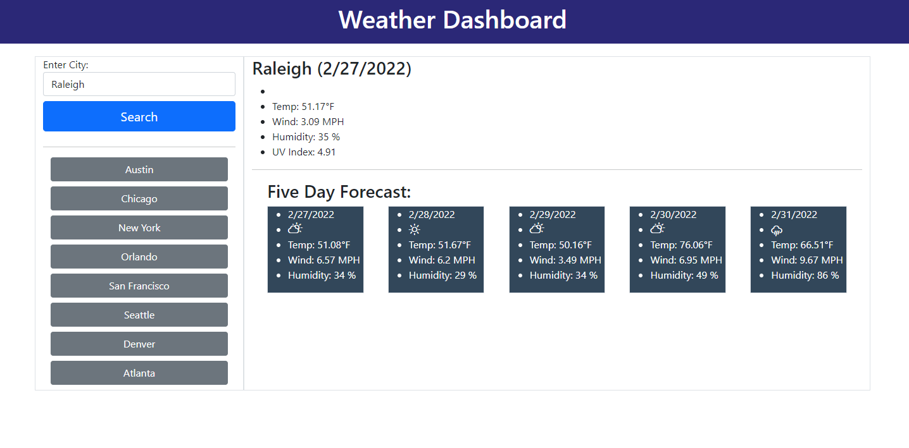

# weather-dashboard

## Purpose
I travel every week for work and I need to see the weather outlook for multiple cities, so I can plan my trip accordingly. Other than the current date I will like to check the following: temperature, humidity, wind speed and the UV index because I have to drive long distances. It is also very important to have 5-day forecast to display in this program. I will also like to see an icon representation of the weather.

## Built With
* HTML
* JS
* CSS
* weather API - openweathermap.org
* bootstrap
* cloudflare.com for weather icons

## Images

## Website
https://gisewaltzer.github.io/weather-dashboard/

## Contribution
Made with ❤️ by Gisella Waltzer